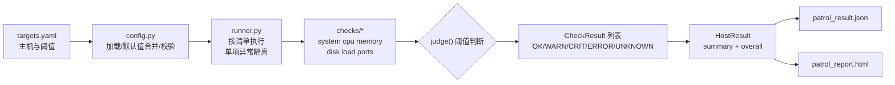

# Linux 主机巡检工具（syspatrol）

把零散的 Linux 巡检命令收拢成一个**配置驱动、结果结构化、可生成报告**的小工具。

```text
targets.yaml → 采集 CPU/MEM/Disk/Load/Ports → 阈值判断 → JSON 结果 → HTML 报告
```

支持 **CentOS / RHEL 7/8/9**，Python 3.6+，第三方依赖仅 PyYAML。

## 特性

- **配置驱动**：主机与阈值全部来自 `targets.yaml`，不写死在代码中；内置默认值 + 严格校验（拼错检查名、阈值写反会直接报错）
- **5 类核心检查 + 基础信息**：CPU / 内存 / 磁盘 / 负载 / 端口监听 + 主机名/IP/OS 信息
- **单项失败不拖垮整体**：任一检查超时/失败只标记该条为 `ERROR`，其余检查照常执行
- **结构化结果**：JSON（`ensure_ascii=False`）+ 自包含 HTML 报告（内联 CSS、无外部依赖、可离线查看）
- **健壮的采集方式**：优先读 `/proc` 文件系统 + 标准库（不用 psutil），无编译依赖；lscpu 用 `LANG=C` 执行并容忍 7/8/9 版本字段差异
- **退出码遵循 Nagios 惯例**（0/1/2），便于未来接入监控告警

## 架构与数据流



## 目录结构

```
├── patrol.py              # CLI 入口（--config/--json/--html）
├── targets.example.yaml   # 示例配置（复制为 targets.yaml 使用）
├── syspatrol/
│   ├── models.py          # 状态机：Status/CheckResult/HostResult/judge()
│   ├── config.py          # YAML 加载、默认值合并、schema 校验
│   ├── runner.py          # 执行编排与异常隔离
│   ├── report.py          # JSON 导出 + 自包含 HTML 渲染
│   └── checks/            # 六个检查模块 + 注册表（新增检查只需在此登记）
└── tests/                 # 131 个单元测试 + 7/8/9 真实格式样本 fixtures
```

## 环境要求

| 项 | 要求 |
|---|---|
| 操作系统 | CentOS / RHEL 7/8/9（本机运行） |
| Python | 3.6+（CentOS 7 自带 3.6.8 即可） |
| 第三方库 | 仅 PyYAML（纯 Python fallback，无编译依赖） |

## 安装

在线环境：

```bash
pip install -r requirements.txt
```

离线环境（内网主机）：

```bash
# 在联网机上提前下载 wheel 包
pip download -r requirements.txt -d wheels/

# 将 wheels/ 目录拷贝到目标主机后安装
pip install --no-index --find-links wheels/ -r requirements.txt
```

> 注意：下载包的联网机需与目标主机**同为 Linux**（在 Windows 上执行会下载 Windows 平台包，装不上）。跨平台下载时改用：
> `pip download -r requirements.txt -d wheels/ --only-binary=:all: --platform manylinux2014_x86_64 --python-version 36`

## 快速开始

```bash
# 1. 准备配置
cp targets.example.yaml targets.yaml
vi targets.yaml    # 修改阈值与待检端口

# 2. 执行巡检（CPU 双采样默认间隔 1 秒，全量约 2-3 秒）
python patrol.py

# 输出：
#   巡检完成: 主机=localhost 总体=OK (OK 9 / WARN 0 / CRIT 0 / ERROR 0 / UNKNOWN 0)
#   JSON 结果: patrol_result.json
#   HTML 报告: patrol_report.html
```

## CentOS 7 虚拟机部署实测（从零到报告）

以下为在全新 CentOS 7 虚拟机上从零部署的完整步骤，各步附预期结果。`<VM_IP>` 替换为虚拟机 IP；Windows 侧命令在 Git Bash 中执行。

### 1. 打包并上传项目

```bash
# Windows（Git Bash）：
cd /d/vibeCoding/linux_sys_patrol
tar czf syspatrol.tar.gz --exclude=.git --exclude=__pycache__ \
  patrol.py syspatrol targets.example.yaml requirements.txt
scp syspatrol.tar.gz root@<VM_IP>:/root/
# 预期: 输入 root 密码后显示 100% 传输完成
```

> 备选：VMware 共享文件夹 / VirtualBox 拖拽，效果相同。

### 2. 安装 Python 3.6 与 pip

```bash
python3 --version                 # 预期: Python 3.6.8，已有则跳过安装
yum install -y python3            # 无 python3 时执行
python3 -m pip --version          # 有 pip 输出则跳到第 3 步
yum install -y epel-release       # 无 pip 时执行（pip 在 EPEL 源）
yum install -y python3-pip
```

### 3. 解压并安装依赖

```bash
cd /root
tar xzf syspatrol.tar.gz
pip3 install -r requirements.txt
# 预期: Successfully installed PyYAML-6.0.3
# 网络慢可换国内源: pip3 install -i https://pypi.tuna.tsinghua.edu.cn/simple PyYAML
```

### 4. 准备配置并执行

```bash
cp targets.example.yaml targets.yaml
vi targets.yaml                   # 按需修改阈值与待检端口，不改也能直接跑
python3 patrol.py
# 预期输出（数字随机器而异）:
#   巡检完成: 主机=localhost 总体=CRIT (OK 9 / WARN 0 / CRIT 1 / ERROR 0 / UNKNOWN 0)
#   JSON 结果: patrol_result.json
#   HTML 报告: patrol_report.html
echo $?                           # 预期: 2（示例中 80 端口未监听 → CRIT）
```

说明：端口 22（sshd）默认监听 → OK；80 未装 httpd/nginx 时不监听 → CRIT，正好演示告警。全量耗时约 2-3 秒（CPU 双采样占约 1 秒）。

### 5. 查看结果

```bash
python3 -m json.tool patrol_result.json | head -40
# 预期: 结构化 JSON，含 host/overall/summary/results 及各项指标

# Windows（Git Bash）把报告传回浏览器查看:
scp root@<VM_IP>:/root/patrol_report.html .
start patrol_report.html
# 预期: 浏览器显示带配色徽章与统计卡片的报告；断网打开也正常（自包含）
```

### 6. 验证错误隔离（可选）

```bash
mv /usr/bin/lscpu /usr/bin/lscpu.bak; python3 patrol.py; mv /usr/bin/lscpu.bak /usr/bin/lscpu
```

预期：中间一次运行的 `CPU 拓扑信息` 为 ERROR，`CPU 使用率` 及其余检查照常 OK，巡检完整执行不中断。（分号保证 lscpu 一定恢复）

### 常见问题

| 现象 | 解决 |
|---|---|
| `python3: command not found` | `yum install -y python3` |
| `No module named pip` | `yum install -y epel-release && yum install -y python3-pip` |
| `No module named 'yaml'` | `pip3 install -r requirements.txt` |
| `错误: 无法读取配置文件` | 确认在 `/root` 下执行，或 `python3 patrol.py -c /root/targets.yaml` |
| `错误: 配置校验失败` | 按提示逐条修正（错误信息会一次性列出所有问题） |
| 端口 80 显示 CRIT | 未监听属正常现象；`yum install -y httpd && systemctl start httpd`，或从配置删掉该端口 |
| 终端中文乱码 | `export LANG=zh_CN.UTF-8`（不影响文件内容，文件本身是 UTF-8） |

## 配置参考

完整示例见 [targets.example.yaml](targets.example.yaml)。未配置的字段使用内置默认值：

| 字段 | 默认值 | 说明 |
|---|---|---|
| `global.checks` | 全部 6 项 | 启用的检查：system/cpu/memory/disk/load/ports |
| `global.timeout` | 10 | 每个子进程的超时秒数 |
| `global.cpu_sample_interval` | 1.0 | CPU 使用率双采样间隔（秒），最小 0.2 |
| `cpu/memory/disk.warning/critical` | 80 / 90 | 使用率阈值（%，0-100，**>= 达线**） |
| `disk.include_fs` | xfs,ext2,ext3,ext4,nfs | 参与检查的文件系统类型白名单 |
| `load.warning/critical` | auto | 数字（1 分钟负载绝对值）或 auto（=核心数 / 2×核心数） |
| `ports.items` | 必填 | 待检端口列表，每项 `port` 必填、`name`/`address` 可选 |

校验规则：warning 必须小于 critical（相等拒绝）；`ports` 启用但 items 为空视为配置错误；主机条目 >1 会提示"多主机为后续版本功能"。

## 输出与退出码

- **JSON 结果**：顶层信封 `{tool, version, generated_at, host, overall, summary, results}`，按"每主机"组织，为 SSH 多主机扩展留位
- **HTML 报告**：自包含单文件，含总体状态、五态统计卡片、分检查项明细表，断网可正常打开
- **退出码**（Nagios 惯例）：

| 退出码 | 含义 |
|---|---|
| 0 | 全部 OK |
| 1 | 存在 WARN / UNKNOWN |
| 2 | 存在 CRIT / ERROR，或程序自身错误（配置错误、报告写盘失败） |

## 状态机

| 状态 | 产生条件 |
|---|---|
| OK | 检查成功且指标未越界 |
| WARN | 指标 >= warning 且 < critical |
| CRIT | 指标 >= critical；或配置的必需端口未监听 |
| ERROR | 检查执行失败（子进程超时/不存在、文件 IO 错误） |
| UNKNOWN | 检查跑通但数据不可用（如 lscpu 缺少字段） |

## 运行测试

```bash
pip install -r requirements-dev.txt
pytest
```

测试在 Windows/Linux 均可运行：采集层通过 `SystemPaths` 注入 fixtures 样本（按 CentOS 7/8/9 真实输出格式制作），解析函数纯函数化直测，不依赖真实 `/proc`。

## 设计取舍

采集方式选择、NFS 阻塞风险等记录见 [docs/decisions.md](docs/decisions.md)。

## Demo 截图

> 在 Linux 主机上执行后截图报告替换此处：

```


```

## 路线图（LEVEL UP）

- [ ] SSH 多主机巡检（结果结构已按"每主机"组织，扩展点已预留）
- [ ] 并发执行 + 超时控制
- [ ] Webhook / 邮件通知
- [ ] Prometheus textfile exporter 输出
- [ ] statvfs 子进程隔离（彻底解决 NFS D 状态阻塞）
