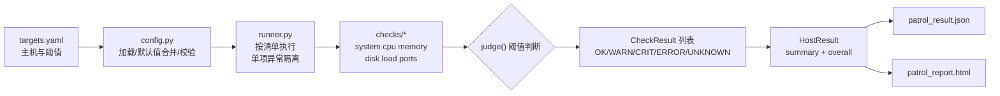

# 项目任务要点与实施方案

> 项目名称：Linux 主机巡检工具（syspatrol）
> 状态：MVP 已完成（首次提交 `eed5f5c`）
> 日期：2026-09-07

---

## 一、任务要点

### 1.1 项目简述

把零散的 Linux 巡检命令收拢成一个**配置驱动、结果结构化、可生成报告**的小工具。这是运维新人第一个"脚本 ≠ 项目"的工程作品：同样是 CPU、内存、磁盘、端口检查，加上配置、异常处理、报告和测试以后，就是一份可展示的完整工程。

### 1.2 项目数据流

```text
targets.yaml → 采集 CPU/MEM/Disk → 阈值判断 → JSON Result → HTML Report
```

### 1.3 MVP 最低完成标准

| 标准 | 说明 |
|---|---|
| 检查类型 ≥ 5 | 支持 CPU、内存、磁盘、负载、端口至少 5 类检查 |
| 配置驱动 | 主机和阈值从 YAML 读取，不写死在代码中 |
| 故障隔离 | 异常主机/命令失败不能导致整个任务退出 |
| 报告输出 | 生成 Markdown 或 HTML 巡检报告 |
| 配套交付 | 提供 README、示例配置和基础测试 |

### 1.4 LEVEL UP 进阶挑战（未实现，留作路线图）

- SSH 多主机巡检
- 并发执行 + 超时控制
- Webhook / 邮件通知
- Prometheus textfile exporter 输出

### 1.5 最终交付物清单

- [x] GitHub Repository + 清晰 README（仓库已初始化，推送待办）
- [x] 架构/数据流图（README 中 Mermaid 图）
- [ ] Demo 截图或 GIF（需在 Linux 实机上执行后补充）
- [ ] Dockerfile（本工具直接跑在目标主机上，适用性低，暂缓）
- [x] 核心路径测试（131 个单元测试）
- [x] 记录一次 Bug、一次设计取舍、一次 AI 错误（见 `docs/decisions.md`）

---

## 二、需求澄清与关键决策

规划阶段与需求方确认的决策（本方案以此为准）：

| 决策点 | 结论 | 理由 |
|---|---|---|
| 初版 shell 脚本定位 | Python 重构，shell 仅作逻辑蓝本 | 符合任务要点技术栈建议；shell 难以做结构化数据与测试 |
| 巡检范围 | MVP 仅本机巡检 | SSH 多主机为 LEVEL UP；结果结构按"每主机"组织预留扩展位 |
| 检查项范围 | 核心 5 类 + 基础信息 | 严格最小 MVP：system/cpu/memory/disk/load/ports |
| 第三方依赖 | 仅 PyYAML | /proc + 标准库采集（不用 psutil）、标准库模板渲染 HTML（不用 Jinja2），CentOS 7 离线部署零编译依赖 |
| 目标系统 | CentOS / RHEL 7/8/9，Python 3.6+ | CentOS 7 自带 3.6.8，代码禁用 3.7+ 语法特性 |
| 输出形式 | JSON 结果 + HTML 报告 | 结构化结果供二次处理，HTML 供人工查看 |

---

## 三、技术方案

### 3.1 总体架构



### 3.2 模块设计

```
├── patrol.py              # CLI 入口：argparse，退出码 0/1/2（Nagios 惯例）
├── targets.example.yaml   # 示例配置（复制为 targets.yaml 使用）
├── syspatrol/
│   ├── models.py          # 状态机：Status 枚举、SEVERITY、Metric/CheckResult/HostResult、judge()
│   ├── config.py          # YAML 加载、内置默认值深合并、schema 校验（一次报全部错误）
│   ├── runner.py          # 执行编排与异常隔离
│   ├── report.py          # JSON 导出 + 自包含 HTML 渲染（内联 CSS、html.escape）
│   └── checks/
│       ├── __init__.py    # REGISTRY 注册表：{检查名: 检查类}，新增检查零改动接入
│       ├── base.py        # BaseCheck 基类、SystemPaths 路径注入、run_cmd 子进程封装
│       ├── system.py      # 主机名/IP（三级降级）/OS 版本/内核/架构/运行时长
│       ├── cpu.py         # lscpu 拓扑（LANG=C）+ /proc/stat 双采样使用率
│       ├── memory.py      # /proc/meminfo 使用率 + Swap 信息（MemAvailable 缺失回退）
│       ├── disk.py        # /etc/fstab 过滤 + os.statvfs（逐挂载点隔离）
│       ├── load.py        # os.getloadavg + auto 阈值（=核心数/2×核心数）
│       └── ports.py       # /proc/net/tcp(+6) 监听判定（不依赖 ss/netstat）
└── tests/                 # 131 个单元测试 + CentOS 7/8/9 真实格式样本 fixtures
```

### 3.3 状态机设计

| 状态 | 产生条件 | 严重度 |
|---|---|---|
| OK | 检查成功且指标未越界 | 0 |
| WARN | 指标 >= warning 且 < critical | 2 |
| CRIT | 指标 >= critical；或必需端口未监听 | 3 |
| ERROR | 检查执行失败（子进程超时/不存在、IO 错误） | 4 |
| UNKNOWN | 检查跑通但数据不可用（如 lscpu 缺字段） | 1 |

- 阈值语义统一 `>=` 达线（等于阈值即告警），消除边界歧义
- `overall` = 全体结果中严重度最高者；无结果时视为 UNKNOWN
- 退出码：OK → 0；WARN/UNKNOWN → 1；CRIT/ERROR → 2（Nagios 惯例，便于接入监控）

### 3.4 异常隔离设计（MVP 硬要求）

**第一层 runner 级**：每个检查的构造 + 执行全包进 `try/except Exception`，失败生成一条 ERROR 结果（附异常类型与消息）并继续执行；异常同时走 `logging.exception` 保留完整 traceback；不捕 `BaseException`（KeyboardInterrupt 必须穿透）。

**第二层 检查内部**：disk 逐挂载点 try/except（stale NFS 只坏一条）；ports 先整体读文件（两文件都不可读才报错）；cpu 的 lscpu 失败只影响拓扑结果，使用率照常采集。

**第三层 CLI 级**：报告生成/写盘失败 catch 后 stderr 报错、退出码 2，绝无裸 traceback。

### 3.5 采集方式选型：初版 shell 的问题与对应修复

| 初版 shell 脚本问题 | Python 重构方案 |
|---|---|
| `top -bn1` 解析 CPU 使用率（版本/locale 差异大、口径难定） | 读 `/proc/stat` 两次采样差分；guest/guest_nice 已计入 user/nice，求和中显式忽略 |
| `uptime` 文本解析负载 | `os.getloadavg()` 标准库 |
| `free -m` 固定行号解析 | 解析 `/proc/meminfo` key→kB dict；MemAvailable 缺失回退 `MemFree+Buffers+Cached-Shmem`（保守近似并注明） |
| `lscpu` 直接按英文表头解析（中文 locale 下表头被翻译） | `LANG=C lscpu` + dict 式解析只取所需键，缺字段 → UNKNOWN 不崩溃 |
| `df -h` 文本解析 | `os.statvfs`，口径与 df 同源（`(f_blocks-f_bfree)/f_blocks`） |
| **端口检查缺失**（MVP 明确要求） | 新增：解析 `/proc/net/tcp(+6)`（hex 端口、小端序地址反转），tcp6 缺失容错 |
| NTP/YUM 检查写死 CentOS 7 | MVP 范围裁剪（核心 5 类），相关检查留待扩展 |
| 硬编码路径 `/server/scripts/shell/` | 全部配置化；输出默认当前目录，可用 CLI 参数指定 |
| 扁平 CSV + GBK 副本 | 结构化 JSON + 自包含 HTML（UTF-8，无编码转换问题） |
| 无阈值判断、无错误标记 | 五态状态机 + 两层异常隔离 |

### 3.6 配置 Schema

```yaml
global:
  checks: [system, cpu, memory, disk, load, ports]   # 缺省全启用
  timeout: 10                # 子进程超时秒数
  cpu_sample_interval: 1.0   # CPU 双采样间隔（秒），最小 0.2
hosts:                       # MVP 仅允许 1 条，多主机报错（留位）
  - host: localhost
    cpu: {warning: 80, critical: 90}
    memory: {warning: 80, critical: 90}
    disk: {warning: 80, critical: 90, include_fs: [xfs, ext2, ext3, ext4, nfs]}
    load: {warning: auto, critical: auto}   # auto = 核心数 ×1 / ×2
    ports:
      items: [{port: 22, name: sshd}, {port: 80, name: nginx}]   # address 可选
```

- 内置默认值写在 `config.py` 的 `DEFAULT_CONFIG`/`CHECK_DEFAULTS`，与用户 YAML **深合并**
- 校验一次性收集全部错误后抛 `ConfigError`：未知检查名、warning ≥ critical、百分比越界、端口越界/items 为空、hosts > 1 等
- 百分比阈值必须 0-100 且 warning < critical（相等拒绝，避免边界歧义）

### 3.7 可测试性设计

- **SystemPaths 注入**：`/proc/stat`、`/proc/meminfo` 等路径集中在一个容器类，构造时注入。开发机（Windows 无 /proc）与测试全部走 fixtures 目录，生产用默认真实路径
- **解析函数纯函数化**：`parse_lscpu()`、`parse_meminfo()`、`parse_net_conns()` 等不碰 IO，是测试主战场
- **fixtures 按真实格式制作**：lscpu 覆盖 util-linux 2.23（C7）/2.32（C8）/2.37（C9，含字段缩进）三版本差异；`/proc/stat` 双采样对手算期望值对照
- 平台专有 API（`os.getloadavg`/`os.statvfs`/`pwd`）在测试中经 `raising=False` 注入模拟

### 3.8 兼容性设计

- **Python 3.6 清单**（写死禁用的 3.7+ 特性）：dataclasses、walrus 运算符、`subprocess.run(capture_output=)`、`text=True`（用 `universal_newlines=True`）、f-string 调试符、`time.time_ns`
- CheckResult 用普通类 + `__slots__`（异常路径需就地改 status）；`Status(str, enum.Enum)` 保证序列化友好
- HTML 报告：单文件自包含、内联 CSS、无 CDN（主机可能离线）、所有动态文本过 `html.escape`

---

## 四、实施步骤

按实际执行顺序，每步均有独立验证：

| 步骤 | 内容 | 验证方式 | 结果 |
|---|---|---|---|
| 1 | 项目骨架 + `models.py`（状态机五态、judge、CheckResult/HostResult）+ `test_models.py` | `py_compile` + pytest | 17 个测试通过 |
| 2 | `config.py`（YAML 加载/深合并/全量校验）+ `targets.example.yaml` + `test_config.py` | pytest | 38 个测试通过 |
| 3 | `checks/base.py`（SystemPaths/run_cmd/BaseCheck）+ `test_base.py` | pytest | 子进程三种失败路径全部抛 CheckError |
| 4 | 六个检查模块 + 注册表 + `runner.py` + `report.py` + `patrol.py` | — | 源码齐备 |
| 5 | 测试 fixtures（7/8/9 真实格式样本）+ 六检查/runner/report 测试 | 全量 pytest | 131 个测试全绿 |
| 6 | CLI 端到端实跑（Windows 上 /proc 不存在，恰好模拟"全部检查失败"场景） | `python patrol.py --config targets.example.yaml` | 6 项 ERROR + 1 项 OK，巡检完整执行未中断，报告正常生成，退出码 2——错误隔离达成 |
| 7 | 收尾：README（Mermaid 架构图/离线安装/配置参考/路线图）、requirements、`.gitignore`、`docs/decisions.md`（设计取舍 + Bug + AI 错误记录） | 全量 pytest 复跑 | 131 个测试通过 |
| 8 | `git init` + 配置身份 + 首次提交 | `git log` | commit `eed5f5c` |

**实施中的两个典型问题记录**：

1. **Windows 上 `monkeypatch.setattr(os, "getloadavg")` 报 AttributeError**（9 个测试失败）：这两个 API 为 Linux 专有，Windows 的 `os` 模块无此属性。修复：`raising=False` 注入 + `os.statvfs_result` 改 namedtuple，产品代码零改动。详情见 `docs/decisions.md`。
2. **HTML 五态徽章检查在真实运行时"失败"**：实际运行只有 OK/ERROR 两种状态，WARN/CRIT/UNKNOWN 徽章自然不会出现；五态渲染由单元测试（合成五种状态的结果集）覆盖——验证断言要与真实数据场景匹配。

---

## 五、验证结果与遗留事项

### 已验证

- [x] 131 个单元测试全绿（Windows 上即可运行，不依赖真实 /proc）
- [x] CLI 端到端：配置加载 → 巡检 → JSON/HTML 输出 → 退出码
- [x] 错误隔离：全部检查失败时巡检仍完整执行并生成报告
- [x] HTML 自包含：无外部链接、可离线查看、动态文本已转义
- [x] Python 3.6 兼容性静态扫描（无 3.7+ 语法）

### 遗留事项（由需求方执行）

1. **推送 GitHub**：`git remote add origin <仓库地址> && git push -u origin main`
2. **Linux 实机验证**：在真实 CentOS 7/8/9 或 Docker（`docker run --rm -v $PWD:/app -w /app centos:7 python3.6 patrol.py`）上执行，核对阈值命中与报告
3. **Demo 截图**：执行后将 HTML 报告截图替换 README 占位

---

## 六、后续规划（LEVEL UP 路线）

| 优先级 | 事项 | 说明 |
|---|---|---|
| P0 | SSH 多主机巡检 | 结果信封已按"每主机"组织，扩展点在 runner 层加远程执行器 |
| P0 | 并发执行 + 超时控制 | 多主机后的自然延伸 |
| P1 | 扩展检查项 | 移植初版 shell 的 Swap/DNS/时间同步(chronyd 7/8/9 兼容)/YUM 源/用户/服务检查 |
| P1 | Webhook / 邮件通知 | 依赖退出码已就绪 |
| P2 | Prometheus textfile exporter 输出 | JSON 结果可直接转换 |
| P2 | statvfs 子进程隔离 | 彻底解决 NFS D 状态阻塞 |
